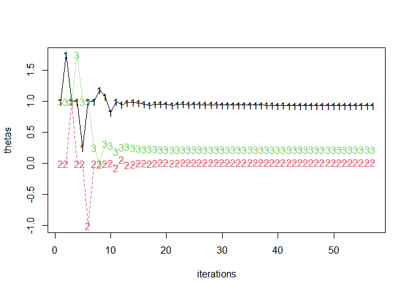

<!-- README.md is generated from README.Rmd. Please edit that file -->

# jlme

<!-- badges: start -->

[](https://CRAN.R-project.org/package=jlme)
[](https://lifecycle.r-lib.org/articles/stages.html#experimental)
[](https://github.com/yjunechoe/jlme/actions/workflows/R-CMD-check.yaml)
[](https://github.com/yjunechoe/jlme/actions/workflows/test-coverage.yaml)
[](https://app.codecov.io/gh/yjunechoe/jlme/)
<!-- badges: end -->

Julia (mixed-effects) regression modelling from R. Powered by the
[`{JuliaConnectoR}`](https://github.com/stefan-m-lenz/JuliaConnectoR) R
package and Julia libraries [GLM](https://github.com/JuliaStats/GLM.jl),
[StatsModels](https://github.com/JuliaStats/StatsModels.jl), and
[MixedModels](https://github.com/JuliaStats/MixedModels.jl).

## Installation

You can install the development version of `{jlme}` from
[GitHub](https://github.com/yjunechoe/jlme) with:

``` r
# install.packages("remotes")
remotes::install_github("yjunechoe/jlme")
```

`{jlme}` is experimental and under active development: see
[NEWS.md](https://github.com/yjunechoe/jlme/blob/main/NEWS.md#jlme-development-version)
for the latest updates.

## Setup

``` r
library(jlme)
jlme_setup()
```

Using `{jlme}` requires a prior installation of the **Julia programming
language**, which can be downloaded from either the [official
website](https://julialang.org/) or using the command line utility
[juliaup](https://github.com/JuliaLang/juliaup).

If you are encountering issues with setting up Julia, please make sure
that you’re have the latest version (\>=1.1.4) of the
[`{JuliaConnectoR}`](https://github.com/stefan-m-lenz/JuliaConnectoR)
package installed and see `` ?JuliaConnectoR::`Julia-Setup` `` for
troubleshooting.

## Usage (table of contents)

- [Fit models](#fit-models)
- [Diagnose models](#diagnose-models)
- [Assess uncertainty](#assess-uncertainty)
- [Julia interoperability](#julia-interoperability)
- [Tips and tricks](#tips-and-tricks)
- [Acknowledgments](#acknowledgments)

## Fit models

[↑Back to table of contents](#usage-table-of-contents)

Once set up, `(g)lm()` and `(g)lmer` complements in Julia are available
via `jlm()` and `jlmer()`, respectively.

### Fixed effects models

`jlm()` with `lm()`/`glm()` syntax:

``` r
# lm(mpg ~ hp, mtcars)
jlm(mpg ~ hp, mtcars)
#> <Julia object of type StatsModels.TableRegressionModel>
#> 
#> mpg ~ 1 + hp
#> 
#> ────────────────────────────────────────────────────────────────────────────
#>                   Coef.  Std. Error      z  Pr(>|z|)   Lower 95%   Upper 95%
#> ────────────────────────────────────────────────────────────────────────────
#> (Intercept)  30.0989      1.63392    18.42    <1e-75  26.8964     33.3013
#> hp           -0.0682283   0.0101193  -6.74    <1e-10  -0.0880617  -0.0483948
#> ────────────────────────────────────────────────────────────────────────────
```

Contrasts in factor columns are preserved:

``` r
x <- mtcars

# Sum code `am`
x$am_sum <- factor(x$am)
contrasts(x$am_sum) <- contr.sum(2)
# Helmert code `cyl`
x$cyl_helm <- factor(x$cyl)
contrasts(x$cyl_helm) <- contr.helmert(3)
colnames(contrasts(x$cyl_helm)) <- c("4vs6", "4&6vs8")

jlm(mpg ~ am_sum + cyl_helm, x)
#> <Julia object of type StatsModels.TableRegressionModel>
#> 
#> mpg ~ 1 + am_sum + cyl_helm
#> 
#> ───────────────────────────────────────────────────────────────────────────────
#>                      Coef.  Std. Error      z  Pr(>|z|)  Lower 95%    Upper 95%
#> ───────────────────────────────────────────────────────────────────────────────
#> (Intercept)       20.6739     0.572633  36.10    <1e-99   19.5516   21.7963
#> am_sum: 1         -1.27998    0.648789  -1.97    0.0485   -2.55158  -0.00837293
#> cyl_helm: 4vs6    -3.07806    0.767861  -4.01    <1e-04   -4.58304  -1.57308
#> cyl_helm: 4&6vs8  -2.32983    0.414392  -5.62    <1e-07   -3.14203  -1.51764
#> ───────────────────────────────────────────────────────────────────────────────
```

### Mixed effects models

`jlmer()` with `lmer()`/`glmer()` syntax:

``` r
# lme4::lmer(Reaction ~ Days + (Days | Subject), lme4::sleepstudy)
jlmer(Reaction ~ Days + (Days | Subject), lme4::sleepstudy, REML = TRUE)
#> <Julia object of type LinearMixedModel>
#> 
#> Linear mixed model fit by REML
#>  Reaction ~ 1 + Days + (1 + Days | Subject)
#>  REML criterion at convergence: 1743.6282719599653
#> 
#> Variance components:
#>             Column    Variance Std.Dev.   Corr.
#> Subject  (Intercept)  612.10016 24.74066
#>          Days          35.07171  5.92214 +0.07
#> Residual              654.94001 25.59180
#>  Number of obs: 180; levels of grouping factors: 18
#> 
#>   Fixed-effects parameters:
#> ──────────────────────────────────────────────────
#>                 Coef.  Std. Error      z  Pr(>|z|)
#> ──────────────────────────────────────────────────
#> (Intercept)  251.405      6.8246   36.84    <1e-99
#> Days          10.4673     1.54579   6.77    <1e-10
#> ──────────────────────────────────────────────────
```

``` r
# lme4::glmer(r2 ~ Anger + Gender + (1 | id), lme4::VerbAgg, family = "binomial")
jlmer(r2 ~ Anger + Gender + (1 | id), lme4::VerbAgg, family = "binomial")
#> <Julia object of type GeneralizedLinearMixedModel>
#> 
#> Generalized Linear Mixed Model fit by maximum likelihood (nAGQ = 1)
#>   r2 ~ 1 + Anger + Gender + (1 | id)
#>   Distribution: Bernoulli{Float64}
#>   Link: LogitLink()
#> 
#>    logLik    deviance     AIC       AICc        BIC    
#>  -4748.2525  9496.5050  9504.5050  9504.5102  9532.2401
#> 
#> Variance components:
#>       Column   VarianceStd.Dev.
#> id (Intercept)  1.12074 1.05865
#> 
#>  Number of obs: 7584; levels of grouping factors: 316
#> 
#> Fixed-effects parameters:
#> ────────────────────────────────────────────────────
#>                   Coef.  Std. Error      z  Pr(>|z|)
#> ────────────────────────────────────────────────────
#> (Intercept)  -1.10115     0.280681   -3.92    <1e-04
#> Anger         0.0462741   0.0134906   3.43    0.0006
#> Gender: M     0.260057    0.153847    1.69    0.0910
#> ────────────────────────────────────────────────────
```

## Diagnose models

[↑Back to table of contents](#usage-table-of-contents)

Supports `{broom}`-style `tidy()` and `glance()` methods for Julia
regression models.

### Summarize model fit

Get information about model components with `tidy()`

``` r
# Note that MixedModels/`jlmer()` defaults to ML (REML=false)
jmod <- jlmer(Reaction ~ Days + (Days | Subject), lme4::sleepstudy)
tidy(jmod)
#>      effect    group                  term     estimate std.error statistic
#> 1     fixed     <NA>           (Intercept) 251.40510485  6.632258 37.906414
#> 2     fixed     <NA>                  Days  10.46728596  1.502236  6.967806
#> 12 ran_pars  Subject       sd__(Intercept)  23.78046792        NA        NA
#> 3  ran_pars  Subject cor__(Intercept).Days   0.08133207        NA        NA
#> 21 ran_pars  Subject              sd__Days   5.71682816        NA        NA
#> 11 ran_pars Residual       sd__Observation  25.59182388        NA        NA
#>          p.value
#> 1  2.017794e-314
#> 2   3.219214e-12
#> 12            NA
#> 3             NA
#> 21            NA
#> 11            NA
```

Get goodness-of-fit measures of a model with `glance()`

``` r
glance(jmod)
#>   nobs df    sigma    logLik      AIC      BIC deviance df.residual
#> 1  180  6 25.59182 -875.9697 1763.939 1783.097 1751.939         174
```

### Inspect model objects

Check singular fit

``` r
issingular(jmod)
#> [1] FALSE
```

List all properties of a MixedModel object (properties are accessible
via `$`)

``` r
propertynames(jmod)
#>  [1] "A"         "b"         "beta"      "betas"     "corr"      "dims"     
#>  [7] "feterm"    "formula"   "L"         "lambda"    "lowerbd"   "objective"
#> [13] "optsum"    "parmap"    "PCA"       "pvalues"   "rePCA"     "reterms"  
#> [19] "sigma"     "sigmarhos" "sigmas"    "sqrtwts"   "stderror"  "theta"    
#> [25] "u"         "vcov"      "X"         "Xymat"     "y"         "β"        
#> [31] "βs"        "θ"         "λ"         "σ"         "σs"        "σρs"
```

Check optimization summary

``` r
jmod$optsum
#> <Julia object of type OptSummary{Float64}>
#> Initial parameter vector: [1.0, 0.0, 1.0]
#> Initial objective value:  1784.642296192471
#> 
#> Optimizer (from NLopt):   LN_BOBYQA
#> Lower bounds:             [0.0, -Inf, 0.0]
#> ftol_rel:                 1.0e-12
#> ftol_abs:                 1.0e-8
#> xtol_rel:                 0.0
#> xtol_abs:                 [1.0e-10, 1.0e-10, 1.0e-10]
#> initial_step:             [0.75, 1.0, 0.75]
#> maxfeval:                 -1
#> maxtime:                  -1.0
#> 
#> Function evaluations:     57
#> Final parameter vector:   [0.9292213025841999, 0.018168360086059557, 0.22264488361408383]
#> Final objective value:    1751.9393444646894
#> Return code:              FTOL_REACHED
```

## Assess uncertainty

[↑Back to table of contents](#usage-table-of-contents)

Functions `parametricbootstrap()` and `profilelikelihood()` can be used
to assess the variability of parameter estimates.

### Parametric bootstrap

Experimental support for
[`MixedModels.parametricbootstrap`](https://juliastats.org/MixedModels.jl/stable/bootstrap/)
via `parametricbootstrap()`:

``` r
samp <- parametricbootstrap(jmod, nsim = 100L, seed = 42L)
samp
#> <Julia object of type MixedModelBootstrap{Float64}>
#> MixedModelBootstrap with 100 samples
#>      parameter  min        q25         median     mean       q75        max
#>    ┌────────────────────────────────────────────────────────────────────────────
#>  1 │ β1         228.0      246.58      250.863    250.977    256.082    264.406
#>  2 │ β2         6.72055    9.91274     10.8382    10.696     11.6725    13.7769
#>  3 │ σ          21.6856    24.6536     25.6211    25.838     26.7439    30.5968
#>  4 │ σ1         3.57556    17.8908     22.1421    21.5799    25.6259    31.9446
#>  5 │ σ2         1.63637    4.53406     5.36349    5.47536    6.38651    8.34052
#>  6 │ ρ1         -0.739267  -0.226513   0.120712   0.107686   0.389495   1.0
#>  7 │ θ1         0.146373   0.675859    0.845334   0.839596   1.02343    1.29287
#>  8 │ θ2         -0.18147   -0.0508505  0.0248657  0.0155747  0.0708033  0.226194
#>  9 │ θ3         0.0        0.156785    0.193042   0.188678   0.238505   0.334108
```

``` r
tidy(samp)
#>     effect    group                  term     estimate    conf.low  conf.high
#> 1    fixed     <NA>           (Intercept) 251.40510485 240.8972974 263.280668
#> 2    fixed     <NA>                  Days  10.46728596   7.7302901  13.540729
#> 5 ran_pars  Subject       sd__(Intercept)  23.78046792  12.5974975  31.944579
#> 4 ran_pars  Subject cor__(Intercept).Days   0.08133207  -0.5948863   1.000000
#> 6 ran_pars  Subject              sd__Days   5.71682816   3.6653412   8.073549
#> 3 ran_pars Residual       sd__Observation  25.59182388  22.4968576  29.124647
```

### Profiling

Experimental support for
[`MixedModels.profile`](https://juliastats.org/MixedModels.jl/stable/api/#MixedModels.profile-Tuple%7BLinearMixedModel%7D)
via `profilelikelihood()`:

``` r
prof <- profilelikelihood(jmod)
prof
#> <Julia object of type MixedModelProfile{Float64}>
#> MixedModelProfile -- Table with 11 columns and 176 rows:
#>       p  ζ          β1       β2       σ        σ1       σ2       ρ1           ⋯
#>     ┌──────────────────────────────────────────────────────────────────────────
#>  1  │ σ  -4.365     251.405  10.4673  20.1933  25.5128  5.97319  -0.0159232   ⋯
#>  2  │ σ  -3.77902   251.405  10.4673  20.8002  25.3434  5.94786  -0.00711109  ⋯
#>  3  │ σ  -3.20526   251.405  10.4673  21.4255  25.1627  5.92133  0.00263598   ⋯
#>  4  │ σ  -2.64336   251.405  10.4673  22.0695  24.9702  5.89214  0.0129078    ⋯
#>  5  │ σ  -2.09298   251.405  10.4673  22.7328  24.7636  5.86167  0.0241968    ⋯
#>  6  │ σ  -1.55378   251.405  10.4673  23.4162  24.5426  5.82871  0.0366992    ⋯
#>  7  │ σ  -1.02542   251.405  10.4673  24.12    24.3063  5.79389  0.0501628    ⋯
#>  8  │ σ  -0.507597  251.405  10.4673  24.845   24.0525  5.75669  0.0649969    ⋯
#>  9  │ σ  0.0        251.405  10.4673  25.5918  23.7805  5.71683  0.0813321    ⋯
#>  10 │ σ  0.497684   251.405  10.4673  26.3611  23.4885  5.6743   0.0993046    ⋯
#>  11 │ σ  0.985728   251.405  10.4673  27.1534  23.1743  5.62882  0.119204     ⋯
#>  12 │ σ  1.46442    251.405  10.4673  27.9696  22.836   5.5802   0.141262     ⋯
#>  13 │ σ  1.93402    251.405  10.4673  28.8104  22.4727  5.52809  0.165869     ⋯
#>  14 │ σ  2.39481    251.405  10.4673  29.6763  22.0799  5.47226  0.193415     ⋯
#>  15 │ σ  2.84704    251.405  10.4673  30.5684  21.6557  5.41243  0.224387     ⋯
#>  16 │ σ  3.29094    251.405  10.4673  31.4872  21.196   5.34818  0.259442     ⋯
#>  17 │ σ  3.72677    251.405  10.4673  32.4337  20.6956  5.27882  0.299408     ⋯
#>  ⋮  │ ⋮      ⋮         ⋮        ⋮        ⋮        ⋮        ⋮          ⋮       ⋱
```

``` r
tidy(prof)
#>      effect    group            term   estimate   conf.low  conf.high
#> 1     fixed     <NA>     (Intercept) 251.405105 237.680694 265.129516
#> 2     fixed     <NA>            Days  10.467286   7.358653  13.575919
#> 12 ran_pars  Subject sd__(Intercept)  23.780468  14.381431  37.718099
#> 21 ran_pars  Subject        sd__Days   5.716828   0.000000   8.753389
#> 11 ran_pars Residual sd__Observation  25.591824  22.898262  28.858001
```

## Julia interoperability

[↑Back to table of contents](#usage-table-of-contents)

Functions `jl_get()` and `jl_put()` transfers data between R and Julia.

### Bring Julia objects into R

Example 1: extract PCA of random effects and return as an R list:

``` r
jmod$rePCA
#> <Julia object of type @NamedTuple{Subject::Vector{Float64}}>
#> (Subject = [0.5406660352881864, 1.0],)
```

``` r
jl_get(jmod$rePCA)
#> $Subject
#> [1] 0.540666 1.000000
```

Example 2: extract fitlog and plot

``` r
fitlog <- jl_get(jl("refit!(deepcopy(x); thin=1)", x = jmod)$optsum$fitlog)
thetas <- t(sapply(fitlog, `[[`, 1))
matplot(thetas, type = "o", xlab = "iterations")
```



### Julia session

See information about the running Julia environment (e.g., the list of
loaded Julia libraries) with `jlme_status()`:

``` r
jlme_status()
#> jlme 0.4.1 
#> R version 4.4.1 (2024-06-14 ucrt) 
#> Julia Version 1.10.5
#> Commit 6f3fdf7b36 (2024-08-27 14:19 UTC)
#> Build Info:
#>   Official https://julialang.org/ release
#> Platform Info:
#>   OS: Windows (x86_64-w64-mingw32)
#>   CPU: 8 × 11th Gen Intel(R) Core(TM) i7-1165G7 @ 2.80GHz
#>   WORD_SIZE: 64
#>   LIBM: libopenlibm
#>   LLVM: libLLVM-15.0.7 (ORCJIT, tigerlake)
#> Threads: 1 default, 0 interactive, 1 GC (on 8 virtual cores)
#> Status `C:\Users\jchoe\AppData\Local\Temp\jl_NI67vu\Project.toml`
#>   [38e38edf] GLM v1.9.0
#>   [ff71e718] MixedModels v4.27.0
#>   [3eaba693] StatsModels v0.7.4
#>   [9a3f8284] Random
```

On setup, `{jlme}` loads [GLM](https://github.com/JuliaStats/GLM.jl),
[StatsModels](https://github.com/JuliaStats/StatsModels.jl), and
[MixedModels](https://github.com/JuliaStats/MixedModels.jl), as well as
those specified in `jlme_setup(add)`. Other libraries such as `Random`
(required for `parametricbootstrap()`) are loaded on an as-needed basis.

### More with `{JuliaConnectoR}`

While users will typically not need to interact with `{JuliaConnectoR}`
directly, it may be useful for extending `{jlme}` features with other
packages in the Julia modelling ecosystem. A simple way to do that is to
use `juliaImport()`, which creates makeshift bindings to any Julia
library.

Here’s an example replicating a workflow using
[`Effects.empairs`](https://beacon-biosignals.github.io/Effects.jl/dev/emmeans/)
for post-hoc pairwise comparisons:

``` r
# New model: 2 (M/F) by 3 (curse/scold/shout) factorial
jmod2 <- jlmer(
  r2 ~ Gender * btype + (1 | id),
  data = lme4::VerbAgg,
  family = "binomial"
)
jmod2
#> <Julia object of type GeneralizedLinearMixedModel>
#> 
#> Generalized Linear Mixed Model fit by maximum likelihood (nAGQ = 1)
#>   r2 ~ 1 + Gender + btype + Gender & btype + (1 | id)
#>   Distribution: Bernoulli{Float64}
#>   Link: LogitLink()
#> 
#>    logLik    deviance     AIC       AICc        BIC    
#>  -4341.4933  8682.9867  8696.9867  8697.0014  8745.5232
#> 
#> Variance components:
#>       Column   VarianceStd.Dev.
#> id (Intercept)  1.52160 1.23353
#> 
#>  Number of obs: 7584; levels of grouping factors: 316
#> 
#> Fixed-effects parameters:
#> ─────────────────────────────────────────────────────────────────
#>                               Coef.  Std. Error       z  Pr(>|z|)
#> ─────────────────────────────────────────────────────────────────
#> (Intercept)                0.738396   0.0956957    7.72    <1e-13
#> Gender: M                  0.404282   0.201612     2.01    0.0449
#> btype: scold              -1.01214    0.0742669  -13.63    <1e-41
#> btype: shout              -1.77376    0.0782721  -22.66    <1e-99
#> Gender: M & btype: scold   0.130832   0.156315     0.84    0.4026
#> Gender: M & btype: shout  -0.533658   0.168832    -3.16    0.0016
#> ─────────────────────────────────────────────────────────────────
```

``` r
library(JuliaConnectoR)
# First call downloads the library (takes a minute)
Effects <- juliaImport("Effects")
# Call `Effects.empairs` using R syntax `Effects$empairs()`
pairwise <- Effects$empairs(jmod2, dof = glance(jmod2)$df.residual)
pairwise
#> <Julia object of type DataFrames.DataFrame>
#> 15×7 DataFrame
#>  Row │ Gender  btype          r2: Y      err       dof    t          Pr(>|t|)  ⋯
#>      │ String  String         Float64    Float64   Int64  Float64    Float64   ⋯
#> ─────┼──────────────────────────────────────────────────────────────────────────
#>    1 │ F > M   curse          -0.404282  0.201612   7577  -2.00524   0.0449725 ⋯
#>    2 │ F       curse > scold   1.01214   0.13461    7577   7.51901   6.15243e-
#>    3 │ F > M   curse > scold   0.477022  0.196994   7577   2.4215    0.0154799
#>    4 │ F       curse > shout   1.77376   0.136284   7577  13.0152    2.57693e-
#>    5 │ F > M   curse > shout   1.90314   0.202352   7577   9.4051    6.75459e- ⋯
#>    6 │ M > F   curse > scold   1.41642   0.201127   7577   7.0424    2.05522e-
#>    7 │ M       curse > scold   0.881304  0.247263   7577   3.56424   0.0003671
#>    8 │ M > F   curse > shout   2.17805   0.202251   7577  10.769     7.53779e-
#>    9 │ M       curse > shout   2.30742   0.251552   7577   9.17273   5.84715e- ⋯
#>   10 │ F > M   scold          -0.535114  0.196498   7577  -2.72326   0.0064789
#>   11 │ F       scold > shout   0.761627  0.135565   7577   5.61817   1.99834e-
#>   12 │ F > M   scold > shout   0.891002  0.201868   7577   4.41378   1.02988e-
#>   13 │ M > F   scold > shout   1.29674   0.197648   7577   6.56086   5.70179e- ⋯
#>   14 │ M       scold > shout   1.42612   0.247866   7577   5.75357   9.07797e-
#>   15 │ F > M   shout           0.129376  0.202988   7577   0.637355  0.523913
#>                                                                 1 column omitted
```

Note that Julia `DataFrame` objects such as the one above can be
collected into an R data frame using `as.data.frame()`. This lets you,
for example, apply p-value corrections using the familiar `p.adjust()`
function in R, though the [option to do
that](https://beacon-biosignals.github.io/Effects.jl/dev/emmeans/#Multiple-Comparisons-Correction)
exists in Julia as well.

``` r
pairwise_df <- as.data.frame(pairwise)
cbind(
  pairwise_df[, 1:2],
  round(pairwise_df[, 3:4], 2),
  pvalue = format.pval(p.adjust(pairwise_df[, 7], "bonferroni"), 1)
)
#>    Gender         btype r2..Y  err pvalue
#> 1   F > M         curse -0.40 0.20  0.675
#> 2       F curse > scold  1.01 0.13  9e-13
#> 3   F > M curse > scold  0.48 0.20  0.232
#> 4       F curse > shout  1.77 0.14 <2e-16
#> 5   F > M curse > shout  1.90 0.20 <2e-16
#> 6   M > F curse > scold  1.42 0.20  3e-11
#> 7       M curse > scold  0.88 0.25  0.006
#> 8   M > F curse > shout  2.18 0.20 <2e-16
#> 9       M curse > shout  2.31 0.25 <2e-16
#> 10  F > M         scold -0.54 0.20  0.097
#> 11      F scold > shout  0.76 0.14  3e-07
#> 12  F > M scold > shout  0.89 0.20  2e-04
#> 13  M > F scold > shout  1.30 0.20  9e-10
#> 14      M scold > shout  1.43 0.25  1e-07
#> 15  F > M         shout  0.13 0.20  1.000
```

## Tips and tricks

[↑Back to table of contents](#usage-table-of-contents)

### Displaying MixedModels

MixedModels.jl supports various [display
formats](https://juliastats.org/MixedModels.jl/stable/mime/) for
mixed-effects models which are available in `{jlme}` via the `format`
argument of `print()`:

``` r
# Rendered via {knitr} with chunk option `results="asis"`
print(jmod, format = "markdown")
```

|             |     Est. |     SE |     z |       p | σ_Subject |
|:------------|---------:|-------:|------:|--------:|----------:|
| (Intercept) | 251.4051 | 6.6323 | 37.91 | \<1e-99 |   23.7805 |
| Days        |  10.4673 | 1.5022 |  6.97 | \<1e-11 |    5.7168 |
| Residual    |  25.5918 |        |       |         |           |

### Data type conversion

Be sure to pass integers (vs. doubles) to Julia functions that expect
Integer type:

``` r
jl_put(1)
#> <Julia object of type Float64>
#> 1.0
```

``` r
jl_put(1L)
#> <Julia object of type Int64>
#> 1
```

The `Dict` (dictionary) data type is common and relevant for modelling
workflows in Julia. `{jlme}` offers `jl_dict()` as an opinionated
constructor for that usecase:

``` r
# Note use of `I()` to protect length-1 values as scalar
jl_dict(a = 1:2, b = "three", c = I(4.5))
#> <Julia object of type Dict{Symbol, Any}>
#> Dict{Symbol, Any} with 3 entries:
#>   :a => [1, 2]
#>   :b => ["three"]
#>   :c => 4.5
```

See `` ?JuliaConnectoR::`JuliaConnectoR-package` `` for a comprehensive
list of data type conversion rules.

### Performance (linear algebra backend)

Using [`MKL.jl`](https://github.com/JuliaLinearAlgebra/MKL.jl) or
[`AppleAccelerate.jl`](https://github.com/JuliaLinearAlgebra/AppleAccelerate.jl)
may improve model fitting performance (but see the system requirements
first). This should be supplied to the `add` argument to `jlme_setup()`,
to ensure that they are loaded first, prior to other packages.

``` r
# Not run
jlme_setup(add = "MKL", restart = TRUE)
jlme_status() # Should now see MKL loaded here
```

### Performance (data transfer)

If the data is large, a sizable overhead will come from transferring the
data from R to Julia. If you are also looking to fit many models to the
same data, you should first filter to keep only the columns you need and
then use `jl_data()` to send the data to Julia. The Julia object can
then be used in place of an R data frame.

``` r
data_r <- mtcars

# Keep only columns you need + convert with `jl_data()`
data_julia <- jl_data(data_r[, c("mpg", "am")])

jlm(mpg ~ am, data_julia)
#> <Julia object of type StatsModels.TableRegressionModel>
#> 
#> mpg ~ 1 + am
#> 
#> ────────────────────────────────────────────────────────────────────────
#>                 Coef.  Std. Error      z  Pr(>|z|)  Lower 95%  Upper 95%
#> ────────────────────────────────────────────────────────────────────────
#> (Intercept)  17.1474      1.1246   15.25    <1e-51   14.9432     19.3515
#> am            7.24494     1.76442   4.11    <1e-04    3.78674    10.7031
#> ────────────────────────────────────────────────────────────────────────
```

If your data has custom contrasts, you can use `jl_contrasts()` to also
convert that to Julia first before passing it to the model.

``` r
data_r$am <- as.factor(data_r$am)
contrasts(data_r$am) <- contr.sum(2)

data_julia <- jl_data(data_r[, c("mpg", "am")])
contrasts_julia <- jl_contrasts(data_r)

jlm(mpg ~ am, data_julia, contrasts = contrasts_julia)
#> <Julia object of type StatsModels.TableRegressionModel>
#> 
#> mpg ~ 1 + am
#> 
#> ────────────────────────────────────────────────────────────────────────
#>                 Coef.  Std. Error      z  Pr(>|z|)  Lower 95%  Upper 95%
#> ────────────────────────────────────────────────────────────────────────
#> (Intercept)  20.7698     0.882211  23.54    <1e-99   19.0407    22.4989
#> am: 1        -3.62247    0.882211  -4.11    <1e-04   -5.35157   -1.89337
#> ────────────────────────────────────────────────────────────────────────
```

### Just learn Julia

If you spend non-negligible time fitting regression models for your
work, please just [learn Julia](https://julialang.org/learning/)! It’s a
great high-level language that feels close to R in syntax and its
REPL-based workflow.

## Acknowledgments

[↑Back to table of contents](#usage-table-of-contents)

- The [JuliaConnectoR](https://github.com/stefan-m-lenz/JuliaConnectoR)
  R package for powering the R interface to Julia.

- The [Julia](https://julialang.org/) packages
  [GLM.jl](https://github.com/JuliaStats/GLM.jl),
  [StatsModels](https://github.com/JuliaStats/StatsModels.jl), and
  [MixedModels.jl](https://github.com/JuliaStats/MixedModels.jl) for
  interfaces to and implementations of (mixed effects) regression
  models.

- Other R interfaces to MixedModels. It has come to my attention after
  working on this for a while and publishing it to CRAN that there were
  prior efforts by [Mika Braginsky](https://github.com/mikabr) in
  [`{jglmm}`](https://github.com/mikabr/jglmm) and by [Philip
  Alday](https://github.com/palday) in
  [`{jlme}`](https://github.com/palday/jlme). These packages/scripts
  predate `{JuliaConnectoR}` (which I find to be leaner and more robust)
  and are instead built on top of
  [`{JuliaCall}`](https://github.com/JuliaInterop/JuliaCall).
